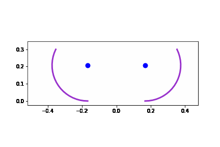

# Параллельное программирование

## 1. Библиотека Pthreads (C++)
* Алгоритм умножения матрицы на вектор
  * по строкам
  * по столбцам
  * по блокам
* QR-декомпозиция матрицы по методу Грама-Шмидта

Графики по результатам прогонов можно найти [здесь](lab1/pthreads_visualization.ipynb).

## 2. Параллельные вычисления на CUDA (C)
* [Задача](lab2/task.pdf) обжатия надувной пневматической конструкции

Графики по результатам прогонов можно найти [здесь](lab2/cuda_visualization.ipynb).